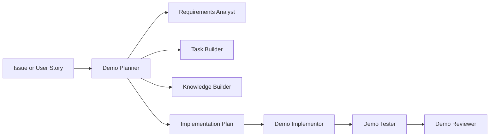

# Enterprise Agentic Development Demo Pack

This folder contains a standalone agentic development demo pack for an enterprise Service Desk IT application. It is inspired by the MoltiAgent workflow, but it is adapted for a teaching demo and does not replace or modify the existing company tooling.

## Purpose

The demo shows the difference between a traditional prompt and an enterprise agentic workflow:

1. Intake a GitHub issue, product request, or sample user story.
2. Analyze gaps, ambiguity, risks, and missing acceptance criteria.
3. Ask focused grooming questions.
4. Produce a specification and task breakdown.
5. Produce an implementation plan with file-level intent and test coverage scenarios.
6. Hand the approved plan to an implementor.
7. Create or update tests.
8. Review the result and produce PR-ready artifacts.

## Layout

```text
enterprise-agentic-demo/
├── AGENTS.md
├── README.md
├── .vscode/
│   └── mcp.json
├── .github/
│   ├── agents/
│   └── skills/
├── .agents/
│   ├── skills/
│   └── templates/
└── examples/
```

Copilot custom agents live in `.github/agents/` because VS Code discovers them from that location. Portable skills and templates live in `.agents/` so the workflow can be reused by other agent runtimes later.

## Demo Stack

- Next.js App Router
- React + TypeScript
- Prisma
- Neon DB
- Neon Auth
- GitHub Issues and Projects
- Vitest
- React Testing Library

## Agent Flow

Use `Demo Planner` as the primary entry point.



The planner is planning-only. It must not implement code, run project commands, or bypass approval. The implementor works only from an approved plan.

## GitHub Issue Intake

Live GitHub issue retrieval is explicit and user-invoked. Use these skills when GitHub MCP access is available:

- `/plan-from-github-issue owner/repo#123` for user stories, features, and service desk requirements.
- `/plan-from-github-bug owner/repo#456` for bug reports that need root-cause analysis before planning.

Both skills are configured with `disable-model-invocation: true`, so they appear as slash commands but are not auto-loaded for generic planning requests.

The workspace MCP configuration is in `.vscode/mcp.json` and defines a `github` MCP server. If the server is enabled and trusted in VS Code, GitHub tools are exposed as `github/*` to the hidden `Demo GitHub Issue Intake` agent.

Bug planning follows an additional gate before `Demo Planner`: gather bug details, inspect likely local causes, expand to code/config/data/external dependencies, present the top probable causes, wait for user cause selection, then create a root-cause-focused planning intake.

## Vision Handling

For screenshots and mockups, the planner should use the active model's native vision capability when available. `Demo Vision UI` is only a fallback subagent for text-only models or environments where image inspection is unavailable.

## Offline Demo Input

Use [examples/sample-service-desk-user-story.md](examples/sample-service-desk-user-story.md) when GitHub issue access is not available.

Expected teaching artifacts are shown in [examples/expected-artifacts](examples/expected-artifacts/).

## Suggested Walkthrough

1. Open the sample user story.
2. Ask `Demo Planner` to plan the story.
3. Answer any grooming questions.
4. Review generated requirements analysis, spec, task breakdown, implementation plan, and test plan.
5. Approve the plan.
6. Ask `Demo Implementor` to implement the approved plan.
7. Ask `Demo Tester` to create or run the relevant tests.
8. Ask `Demo Reviewer` for a technical review.

The teaching point is that the prompt becomes small because the workflow carries the process knowledge.
