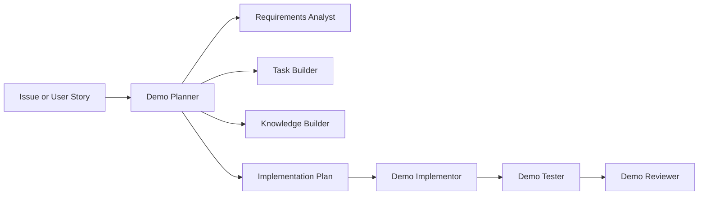

# Enterprise Agentic Development Demo Pack

This folder contains a standalone agentic development demo pack for an enterprise Service Desk IT application. It is inspired by the MoltiAgent workflow, but it is adapted for a teaching demo and does not replace or modify the existing company tooling.

## Purpose

The demo shows the difference between a traditional prompt and an enterprise agentic workflow:

1. Intake a GitHub issue, product request, or sample user story.
2. Create or reuse a named planning session under `sessions/<session-id>/`.
3. Analyze gaps, ambiguity, risks, and missing acceptance criteria.
4. Ask focused grooming questions.
5. Produce a specification and task breakdown.
6. Produce an implementation plan with file-level intent, proposed diffs, and test coverage scenarios.
7. Hand the approved plan to an implementor.
8. Create or update tests.
9. Review the result and produce PR-ready artifacts.

## Layout

```text
enterprise-agentic-demo/
├── AGENTS.md
├── README.md
├── .vscode/
│   └── mcp.json
├── .github/
│   ├── agents/
│   └── skills/
├── .agents/
│   ├── skills/
│   └── templates/
└── sessions/
    └── <session-id>/
```

Copilot custom agents live in `.github/agents/` because VS Code discovers them from that location. Portable skills and templates live in `.agents/` so the workflow can be reused by other agent runtimes later.

Generated workflow artifacts live in local, gitignored `sessions/<session-id>/` packages. GitHub-driven workflows use the issue number as the session ID. Offline workflows ask the user to provide or confirm the session ID, then write `session-brief.md`, `requirements-analysis.md`, `spec.md`, `task-breakdown.md`, `implementation-plan.md`, `test-plan.md`, and later handoff artifacts into that folder.

## Demo Stack

- Next.js App Router
- React + TypeScript
- Prisma
- Neon DB
- Neon Auth
- GitHub Issues and Projects
- Vitest
- React Testing Library

## Prisma and Neon

Prisma is configured for Neon Postgres with Prisma 7's Neon driver adapter.
Application queries use the pooled `DATABASE_URL`; Prisma CLI commands use
`DATABASE_URL_UNPOOLED` from `.env.local` through [prisma.config.ts](prisma.config.ts).

Useful commands:

```bash
pnpm db:generate
pnpm db:migrate
pnpm db:push
pnpm db:studio
```

## Agent Flow

Use `Demo Planner` as the primary entry point.



The planner is planning-only. It must not implement code, run project commands, or bypass approval. The implementor works only from an approved plan in `sessions/<session-id>/`.

## GitHub Issue Intake

Live GitHub issue retrieval is explicit and user-invoked. Use these skills when GitHub MCP access is available:

- `/plan-from-github-issue owner/repo#123` for user stories, features, and service desk requirements.
- `/plan-from-github-bug owner/repo#456` for bug reports that need root-cause analysis before planning.

Both skills are configured with `disable-model-invocation: true`, so they appear as slash commands but are not auto-loaded for generic planning requests.

The workspace MCP configuration is in `.vscode/mcp.json` and defines a `github` MCP server. If the server is enabled and trusted in VS Code, GitHub tools are exposed as `github/*` to the hidden `Demo GitHub Issue Intake` agent.

Bug planning follows an additional gate before `Demo Planner`: gather bug details, inspect likely local causes, expand to code/config/data/external dependencies, present the top probable causes, wait for user cause selection, then create a root-cause-focused planning intake. The selected cause analysis is saved in the planner-created session folder.

## Hidden Subagents

Some agents are intentionally hidden from the user picker with `user-invocable: false`. They exist for main agents to call with a small, clean context packet instead of dragging the full conversation and repository context into every specialist step.

Current hidden subagents:

- `Demo Requirements Analyst`: requirement gaps, risks, and clarification questions.
- `Demo Task Builder`: atomic vertical slices after requirements are known.
- `Demo GitHub Issue Intake`: factual GitHub issue retrieval only.
- `Demo Vision UI`: deterministic visual extraction from screenshots, mockups, and diagrams.
- `Demo Context Scout`: bounded repository evidence packets for one planning or review question.

Main agents expose hidden helpers through their `agents:` allow-list. When adding a new helper, keep it single-purpose, give it minimal tools, set `user-invocable: false`, and pass only the artifact excerpt or bounded question it needs. Add a `model:` only when the exact model name is verified in the local Copilot environment; otherwise leave model selection to the caller.

## Session Artifacts

For GitHub-driven workflows, the session ID is the GitHub issue number. For offline workflows, the user provides or confirms the session ID. The planner creates or reuses `sessions/<session-id>/` before requirements analysis starts.

`implementation-plan.md` includes a `Proposed Diffs` section. These are concise before/after snippets for material code, markdown, configuration, schema, skill, prompt, or agent changes. They are not a replacement for review, but they make the handoff concrete before implementation begins.

## Vision Handling

For screenshots and mockups, the planner should invoke the hidden `Demo Vision UI` subagent and save its `SlimUI v1` plus `Planner Notes` output as the durable visual contract. Native model vision can still help with quick inspection, but it does not replace the artifact-producing subagent path.

## Suggested Walkthrough

1. Start from GitHub issue, product request, or user-provided story.
2. Ask `Demo Planner` to plan the story.
3. Provide or confirm the session ID.
4. Answer any grooming questions.
5. Review generated requirements analysis, spec, task breakdown, implementation plan, and test plan in `sessions/<session-id>/`.
6. Approve the plan.
7. Ask `Demo Implementor` to implement the approved plan from the session folder.
8. Ask `Demo Tester` to create or run the relevant tests.
9. Ask `Demo Reviewer` for a technical review.

The teaching point is that the prompt becomes small because the workflow carries the process knowledge.

## Next.js template

This is a Next.js template with shadcn/ui.

## Adding components

To add components to your app, run the following command:

```bash
npx shadcn@latest add button
```

This will place the ui components in the `components` directory.

## Using components

To use the components in your app, import them as follows:

```tsx
import { Button } from "@/components/ui/button"
```
