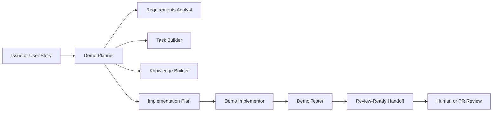

# Enterprise Agentic Development Demo Pack

This folder contains a standalone agentic development demo pack for an enterprise Service Desk IT application. It is inspired by the MoltiAgent workflow, but it is adapted for a teaching demo and does not replace or modify the existing company tooling.

## Purpose

The demo shows the difference between a traditional prompt and an enterprise agentic workflow:

1. Intake a GitHub issue, product request, or sample user story.
2. Create or reuse a named planning session under `sessions/<session-id>/`.
3. Analyze gaps, ambiguity, risks, and missing acceptance criteria.
4. Ask focused grooming questions.
5. Produce a specification and task breakdown.
6. Produce an implementation plan with file-level intent, proposed diffs, and test coverage scenarios.
7. Hand the approved plan to an implementor.
8. Create or update tests.
9. Review the result and produce PR-ready artifacts.

## Layout

Generated workflow artifacts live in local, gitignored `sessions/<session-id>/` packages. GitHub-driven workflows use the issue number as the session ID. Offline workflows ask the user to provide or confirm the session ID, then write `session-brief.md`, `requirements-analysis.md`, `spec.md`, `task-breakdown.md`, `implementation-plan.md`, `test-plan.md`, and later handoff artifacts into that folder.

## Demo Stack

- Next.js App Router
- React + TypeScript
- Prisma
- Neon DB
- Neon Auth
- GitHub Issues and Projects
- Vitest
- React Testing Library

## Prisma and Neon

Prisma is configured for Neon Postgres with Prisma 7's Neon driver adapter.
Application queries use the pooled `DATABASE_URL`; Prisma CLI commands use
`DATABASE_URL_UNPOOLED` from `.env.local` through [prisma.config.ts](prisma.config.ts).

Useful commands:

```bash
pnpm db:generate
pnpm db:migrate
pnpm db:push
pnpm db:studio
```

## Agent Flow

Use `Demo Planner` as the primary entry point.


```mermaid
flowchart LR
    A[Issue or User Story] --> B[Demo Planner]
    B --> C[Requirements Analyst]
    B --> D[Task Builder]
    B --> E[Knowledge Builder]
    B --> F[Implementation Plan]
    F --> G[Demo Implementor]
    G --> H[Demo Tester]
    H --> I[Review-Ready Handoff]
    I --> J[Human or PR Review]
```