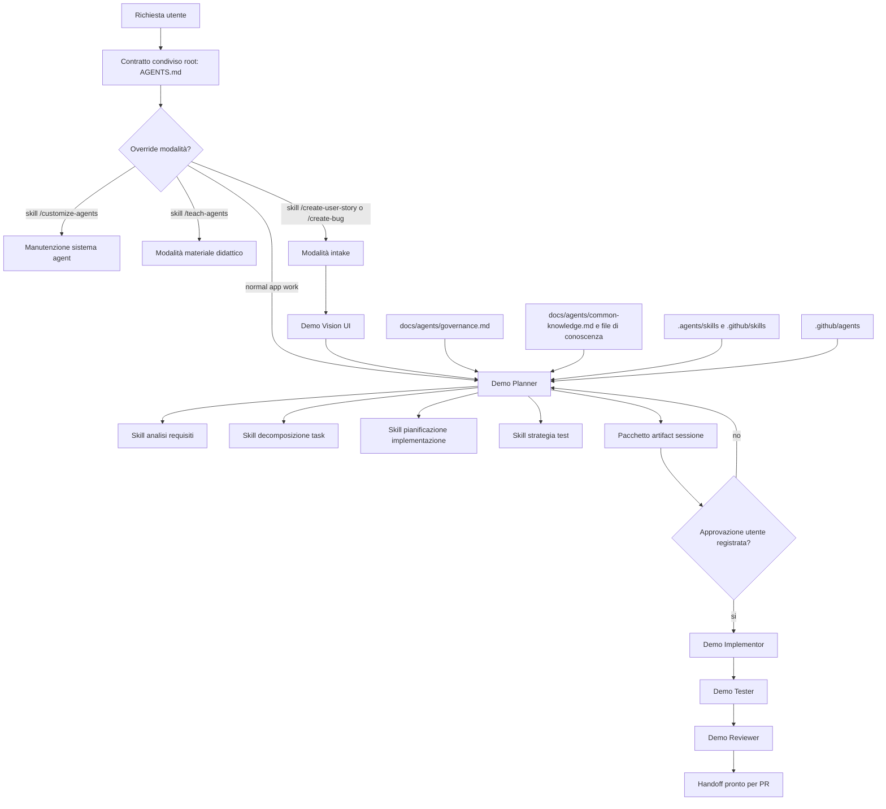

# Mappa Sistema Agentico

Questo documento mappa sistema custom di sviluppo agentico usato come esempio didattico. Obiettivo è mostrare come pezzi si incastrano, non insegnare applicazione service desk.

## Forma del Sistema



## Blocchi Principali

| Blocco | File di esempio | Cosa insegna |
| --- | --- | --- |
| Contratto condiviso | [../AGENTS.md](../AGENTS.md) | Mettere regole globali workflow, switch modalità e precedenza in un solo punto visibile. |
| Agent custom | [../.github/agents/DemoPlanner.agent.md](../.github/agents/DemoPlanner.agent.md), [../.github/agents/DemoVisionUI.agent.md](../.github/agents/DemoVisionUI.agent.md), [../.github/agents/DemoImplementor.agent.md](../.github/agents/DemoImplementor.agent.md), [../.github/agents/DemoTester.agent.md](../.github/agents/DemoTester.agent.md), [../.github/agents/DemoReviewer.agent.md](../.github/agents/DemoReviewer.agent.md) | Separare intake visuale, pianificazione, implementazione, test e review in responsabilità diverse. |
| Skill custom | [../.agents/skills/artifact-workflow/SKILL.md](../.agents/skills/artifact-workflow/SKILL.md), [../.agents/skills/requirements-analysis/SKILL.md](../.agents/skills/requirements-analysis/SKILL.md), [../.agents/skills/implementation-planning/SKILL.md](../.agents/skills/implementation-planning/SKILL.md) | Impacchettare metodi ripetibili come moduli workflow riusabili. |
| Policy durevole | [../docs/agents/governance.md](../docs/agents/governance.md), [../docs/agents/common-knowledge.md](../docs/agents/common-knowledge.md) | Salvare regole cross-session e conoscenza in documenti del repository. |
| Evidenza locale | `sessions/<session-id>/` | Tenere evidenza per task locale e tracciabile senza committare artifact di sessione. |
| Pacchetto didattico | [README.md](README.md), [principles.md](principles.md), [facilitator-guide.md](facilitator-guide.md) | Spiegare sistema come pratica trasferibile invece di implementazione specifica app. |

## Flusso Normale di Sviluppo

```text
Richiesta
  -> intake e selezione sessione
  -> normalizzazione input visuali requirement-relevant
  -> selezione conoscenza
  -> inventario regole di conoscenza
  -> analisi requisiti
  -> clusterizzazione codebase
  -> ricognizione mirata
  -> specifica
  -> decomposizione task
  -> piano implementazione
  -> self-review allineamento conoscenza
  -> piano test
  -> approvazione utente esplicita e metadata
  -> implementazione
  -> validazione
  -> review
  -> handoff
```

Punto didattico non sono nomi file esatti. Punto didattico è che ogni transizione ha artifact nominato, un owner e un gate.

Aggiornamento utile: nel planner attuale, caricamento conoscenza limitato non basta da solo. Prima costruisce un piccolo inventario di regole applicabili dai file di conoscenza selezionati, poi usa clusterizzazione euristica del codebase per limitare letture e infine verifica il piano con una tabella di allineamento conoscenza prima della richiesta di approvazione.

## Modalità Materiale Didattico

`AGENTS.md` ora definisce la skill `/teach-agents` come trigger della modalità materiale didattico. In quella modalità, workflow normale di sviluppo app viene bypassato così l'agent si concentra sul migliorare cartella `Teaching/`.

Quella modalità esiste perché materiale didattico non è stesso tipo di lavoro di sviluppo feature applicative. Non deve richiedere artifact sessione service desk, piani di implementazione app, migrazioni o test prodotto.

## Cosa Copiare in un Altro Team

Copia pattern, non i nomi:

1. Un contratto root per comportamento globale e precedenza.
2. Agent specifici per ruolo nelle transizioni ad alto rischio.
3. Skill per passi di ragionamento ripetibili.
4. Documenti durevoli per governance e conoscenza condivisa.
5. Artifact di sessione per evidenza e approvazione.
6. Un numero piccolo di modalità override esplicite.
7. Un loop di review che controlla sia qualita output sia conformita processo.

## Domande di Adattamento

- Quali errori sono costosi nel workflow del tuo team?
- Quali decisioni richiedono approvazione umana?
- Quale lavoro deve essere diviso tra ruoli?
- Quali artifact provano che agent ha fatto lavoro corretto?
- Quale conoscenza deve essere durevole e quale evidenza deve restare locale al task?
- Quali switch di modalità vale la pena nominare esplicitamente?
