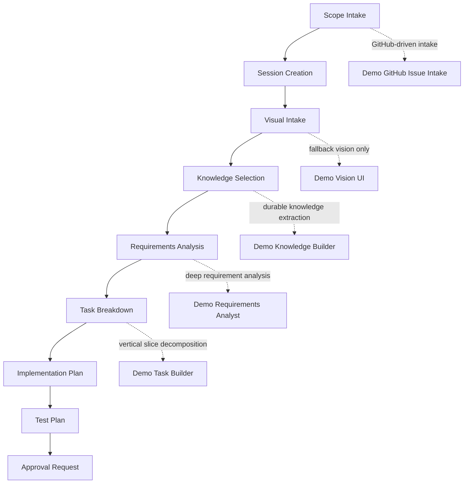
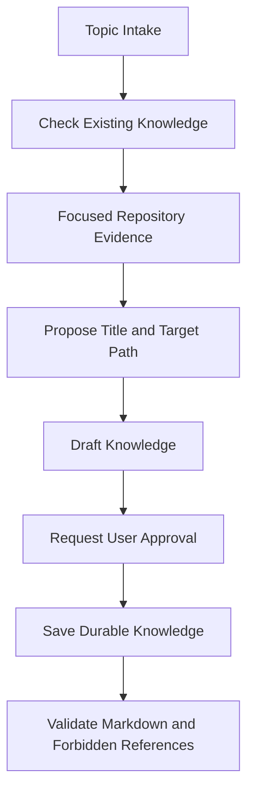
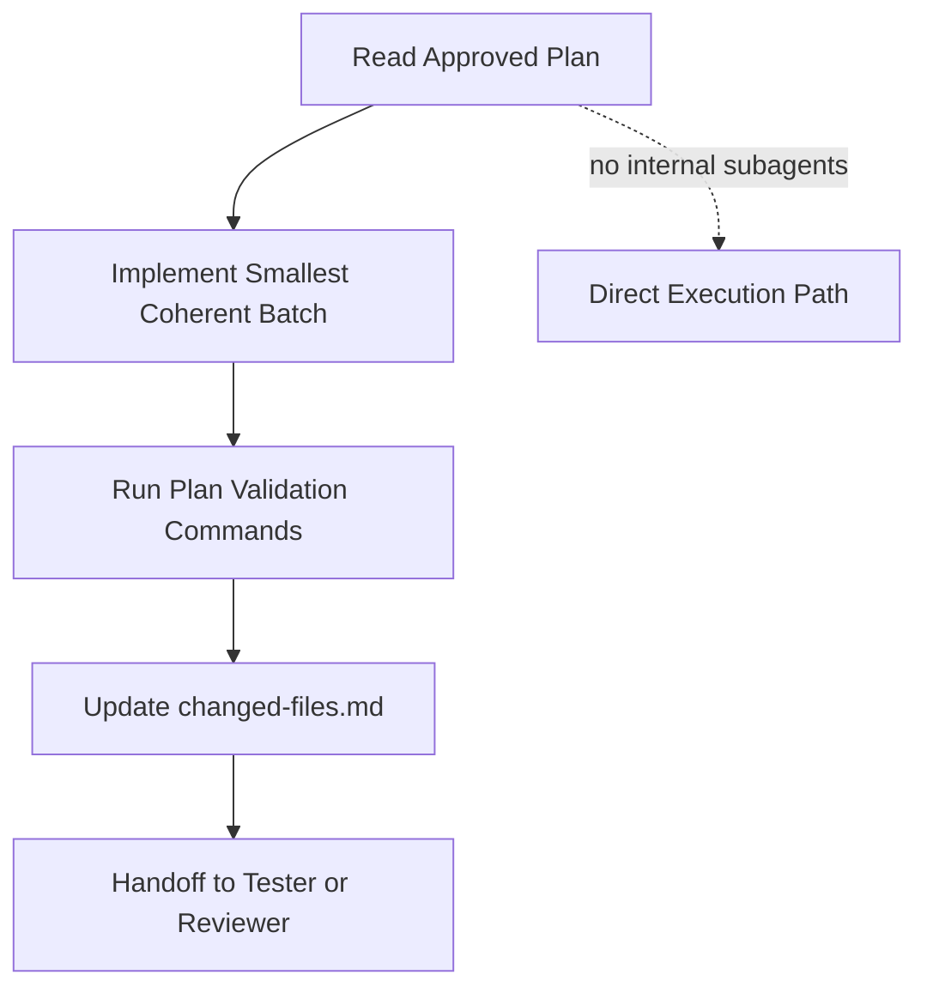
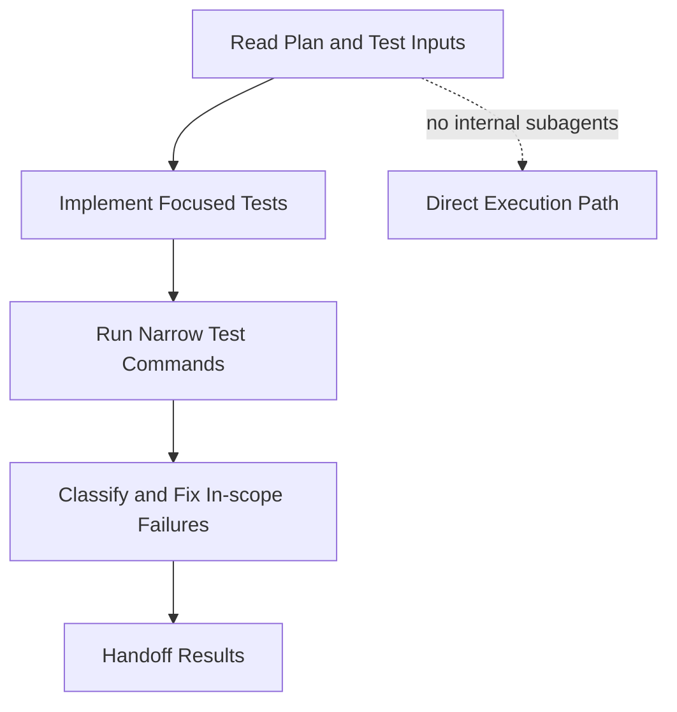
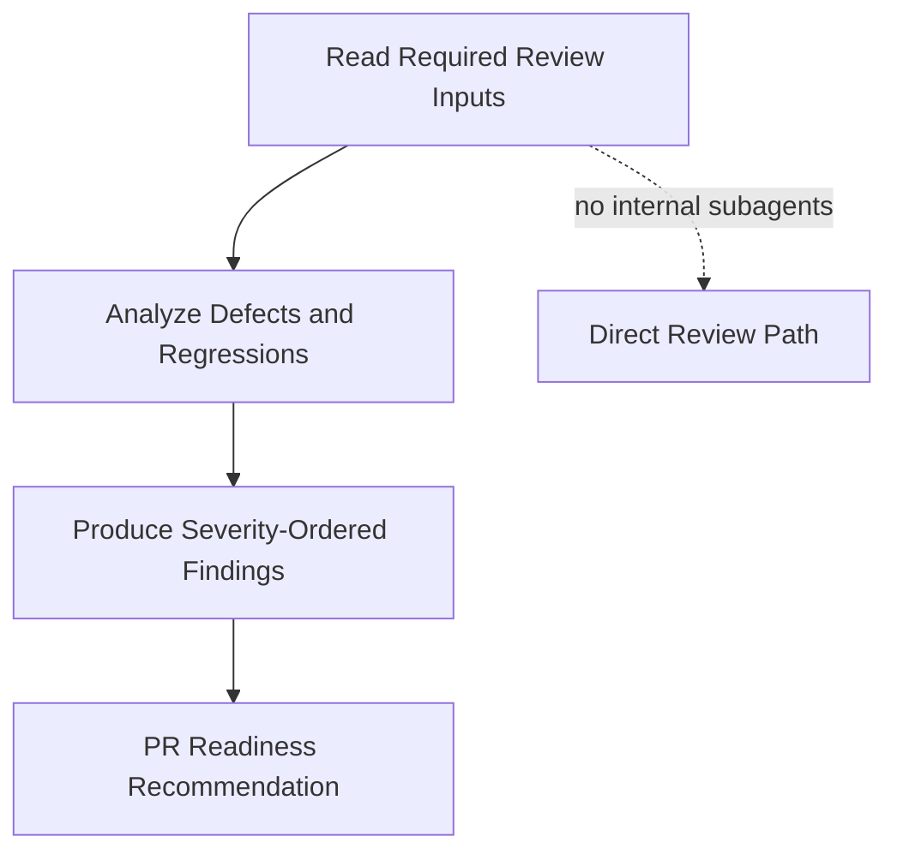

# Agentic System Wiki

This wiki page helps new developers use the agentic workflow in this repository.

## What This System Is

The repo uses a role-based workflow for software delivery:

- intake retrieves source material
- planner plans
- implementor implements
- tester tests
- reviewer reviews
- knowledge builder maintains durable repository knowledge

Policy and behavior are defined in these contract files:

- `AGENTS.md`
- `docs/agents/governance.md`
- `docs/agents/enforcement-spec.md`

Instruction precedence is:

1. `AGENTS.md`
2. agent files under `.github/agents/`
3. custom skill files under `.agents/skills/`
4. non-custom skill files under `.github/skills/`
5. ad hoc prompt instructions

## Agent Customization Mode

If your prompt contains the exact phrase `customize agents`, the assistant switches to agent-customization-only mode.

In this mode:

- The task is treated as agent-system maintenance, not feature development.
- Work is limited to `AGENTS*.md`, `.github/agents/`, `.agents/skills/`, and `.github/skills/`.
- Normal app code changes are out of scope unless explicitly requested.
- Planning and implementation gates for product code are disregarded for that customization task.

## Session Model

All work is organized by session in a local, gitignored folder:

- `sessions/<session-id>/`

Rules:

- For GitHub-driven workflows, use GitHub issue number as session ID.
- Reuse an existing `sessions/<session-id>/` folder when present.
- Create it before planning when missing.
- Session artifacts are not committed.
- Export session artifacts as zip and attach them to the issue ticket.

## Standard Artifacts

Typical files in a session package:

- `session-brief.md`
- `requirements-analysis.md`
- `clarification-questions.md`
- `spec.md`
- `task-breakdown.md`
- `implementation-plan.md`
- `test-plan.md`
- `review-report.md`
- `changed-files.md`

## End-to-End Workflow

1. Intake work item and resolve session ID.
2. Create or reuse `sessions/<session-id>/`.
3. Select only relevant repository knowledge from `docs/agents/knowledge/`.
4. Produce planning artifacts.
5. Request user approval for implementation plan.
6. Record approval metadata.
7. Implement only after approval is valid.
8. Run validation commands from test and implementation plans.
9. Produce handoff artifact for next role.
10. Prepare review artifacts.

## Approval Gate

Implementation can start only if both are true:

1. User explicitly approves in chat.
2. Artifacts contain approval metadata in required files.

Required approval keys:

- `Approved: true`
- `Approved By`
- `Approved At`
- `Source Message`

## Handoff Envelope

Each handoff file must include:

- `Session ID`
- `From Agent`
- `To Agent`
- `Current Gate`
- `Approval State`
- `Required Artifacts`
- `Open Questions`
- `Blocking Risks`
- `Definition of Done for Next Agent`

## Lint and Validation

Use the Phase 1 artifact lint command:

```bash
pnpm agent:lint-artifacts --mode planning-ready --session <session-id>
pnpm agent:lint-artifacts --mode approval-ready --session <session-id>
pnpm agent:lint-artifacts --mode implementation-handoff --session <session-id>
pnpm agent:lint-artifacts --mode review-ready --session <session-id>
```

Lint modes are stage-aware and check artifact completeness and handoff quality.

## Restore a Previous Session

1. Download session zip from issue ticket.
2. Extract under local `sessions/`.
3. Resume using that same session ID.
4. Continue writing artifacts in the restored folder.

## Quick Start for New Developers

1. Read `AGENTS.md` and `docs/agents/governance.md`.
2. Pick a real issue and use issue number as session ID.
3. Create `sessions/<issue-number>/`.
4. Write `session-brief.md` first.
5. Complete planning artifacts.
6. Run `planning-ready` lint.
7. Request user approval.
8. Run `approval-ready` lint.
9. Start implementation and keep `changed-files.md` updated.
10. Run `implementation-handoff` and `review-ready` lints before review handoff.

## User-Invokable Agents

Use these as explicit role tools. In chat, invoke them with direct phrasing such as `Use Demo Planner to ...`.

| Agent                    | When to use                                                                              | How to invoke well                                                                                                  |
| ------------------------ | ---------------------------------------------------------------------------------------- | ------------------------------------------------------------------------------------------------------------------- |
| `Demo Planner`           | You need full planning artifacts from issue/story/screenshot/requirement.                | Provide session ID, source input, constraints, and ask for spec, tasks, implementation plan, and test plan.         |
| `Demo Implementor`       | You have approved plan and need code implementation only.                                | Provide session ID and approved artifact references; request implementation against plan only.                      |
| `Demo Tester`            | You need test planning or test implementation for approved work.                         | Provide feature scope and ask for Vitest/RTL coverage matrix plus commands and residual risks.                      |
| `Demo Reviewer`          | You need final quality review before merge/handoff.                                      | Provide changed files and ask for findings by severity, regressions, gaps, and readiness verdict.                   |
| `Demo Knowledge Builder` | You need durable repository knowledge created or updated from verified project evidence. | Provide one focused knowledge topic and approve the proposed target before it saves under `docs/agents/knowledge/`. |

## Internal-Only Agents

These agents support the workflow but should be invoked by another agent, not used as the main user-facing role.

| Agent                       | Used by                                        | Purpose                                                                                                    |
| --------------------------- | ---------------------------------------------- | ---------------------------------------------------------------------------------------------------------- |
| `Demo GitHub Issue Intake`  | GitHub planning intake skills and planner flow | Retrieve issue metadata, body, comments, labels, assignees, milestones, linked items, and images.          |
| `Demo Requirements Analyst` | `Demo Planner`                                 | Analyze functional gaps, ambiguities, risks, edge cases, and clarification questions.                      |
| `Demo Task Builder`         | `Demo Planner`                                 | Decompose approved requirements or specs into atomic vertical slices with dependencies and blocking edges. |
| `Demo Vision UI`            | `Demo Planner`                                 | Fallback screenshot or mockup analysis when native vision is unavailable.                                  |

## Internal Agent Subagent Flow

### Demo Planner Flow



### Demo Knowledge Builder Flow



### Demo Implementor Flow



### Demo Tester Flow



### Demo Reviewer Flow



## User-Invokable Skills

Use explicit skill requests in prompt.

This section lists only skills with `disable-model-invocation: true`.

### Custom Skills (`.agents/skills/`)

| Skill                    | When to use                                                      | How to invoke well                                                                     |
| ------------------------ | ---------------------------------------------------------------- | -------------------------------------------------------------------------------------- |
| `create-user-story`      | You want to groom a new service desk story from a rough idea.    | Provide the feature idea and answer one intake question at a time.                     |
| `create-bug`             | You want to groom a new service desk bug report from symptoms.   | Provide observed behaviour and answer one reproduction question at a time.             |
| `plan-from-github-issue` | You want direct planning intake from a GitHub issue.             | Provide issue ID/URL and ask for planning intake output format.                        |
| `plan-from-github-bug`   | You want bug-first planning with cause analysis from issue data. | Provide issue ID/URL and request root-cause candidates before implementation planning. |

## Tips

- Keep artifacts small, explicit, and current.
- Do not skip role boundaries unless emergency mode is explicitly requested and documented.
- When in doubt, follow governance first, then agent contract, then skill contract.
